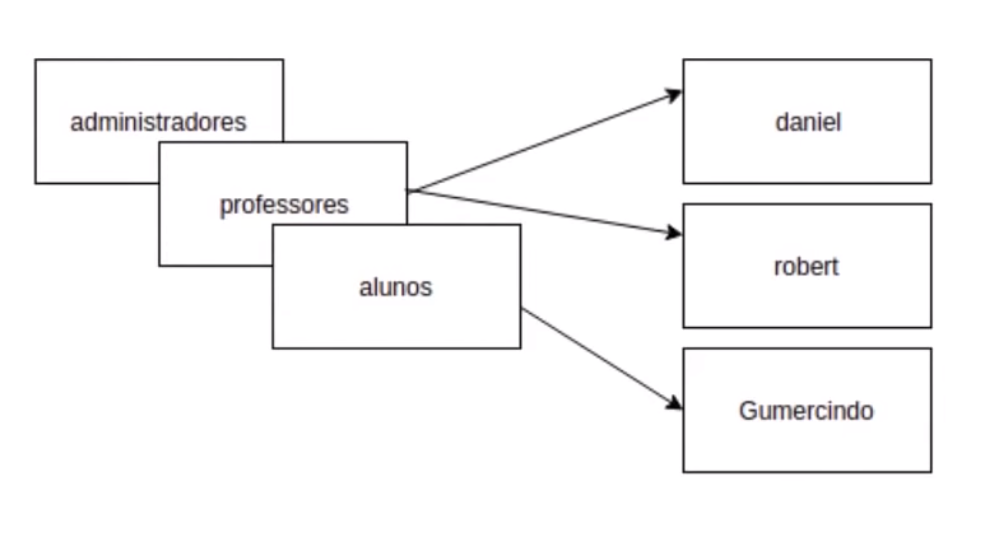
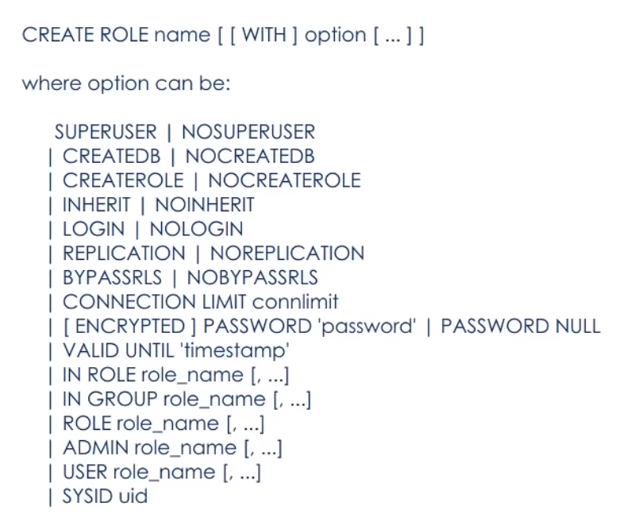
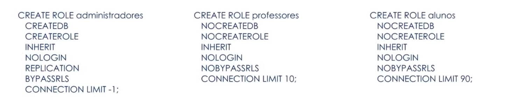
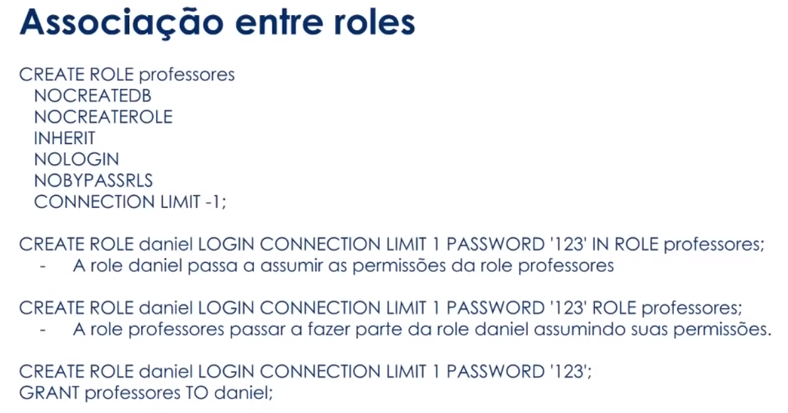
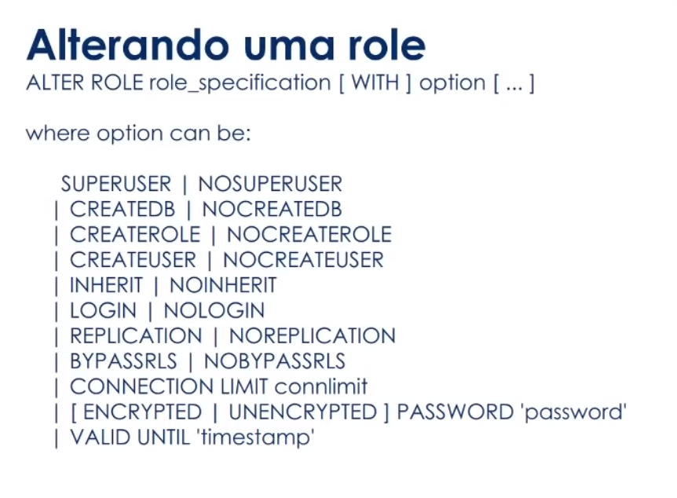
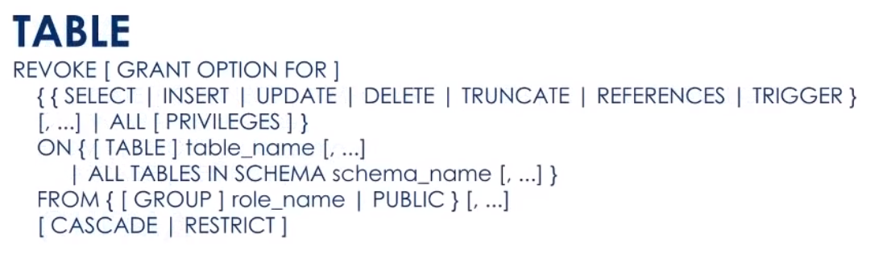

# Conceitos

Roles (papéis ou funções), users (usuários) e grupo de usuários são "contas", perfis de atuação em um banco de dados, que possuem permissões em comum ou específicas.

Nas versões anteriores do PostgreSQL 8.1, usuários e roles tinham comportamentos diferentes. Atualmente, roles e users são alias.

É possível que roles pertençam a outras roles;

## Associação entre roles

Quando uma role assume as permissões de outra role.
Necessário a opção **INHERIT**

No momento de criação da role:
- **IN ROLE** (passa a pertercer a role informada)
- **ROLE** (a role informada passa a pertercer a nova role)

Ou após a criação da role:
- **GRANT** [role a ser concedida] **TO** [role a assumr as permissões]

## Desassociar membros entre roles

- **REVOKE** [role que será revogada] **FROM** [role que terá suas permissões revogadas].

## Excluir uma role

- **DROP ROLE** role_specification;

## Listar roles no terminal
Dentro do psql:

**\du**

