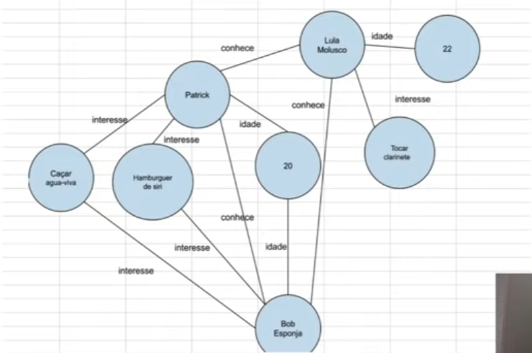
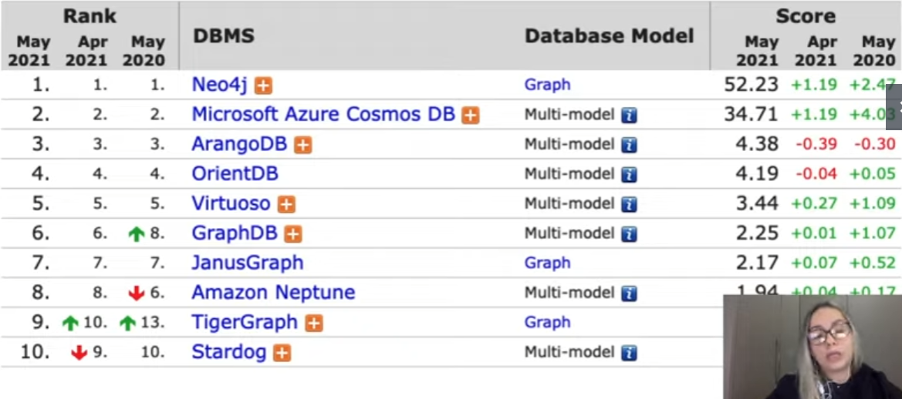

# Grafos

Grafos são basicamente estruturas matemáticas e elas são compostas entre nós e vértices. 

Nós compoem os dados, vértices compoem os relacionamentos.

Sua utilização é comum em detecção de fraudes, mecanismos de recomendação, redes sociais, sistemas de arquivo, games ... 

## Na prática

Vamos criar uma estrutura de registros que compõem os dados de uma rede social utilizando um sandbox do Neo4j.

Neo4j utiliza a linguagem Cypher.

https://neo4j.com/sandbox/

Criação de nós.

    CREATE (:Client {name : "Lucas Santos", age: 25, hobbies: ['programação','musica']})--

Fazer consulta.

    MATCH (lucas_santos) RETURN lucas_santos;

Criação de vários nós já criando relacionamentos.

    CREATE (:Client {name : "Ingrid Santos", age: 5, hobbies: ['musica','desenho']}) - [:Children]->(:Client {name: 'Gabrielli Yoshio', hobbies: ['desenho','games']});

Consulta todos.

    MATCH (todos) RETURN todos;

Criação de labels.

    CREATE (:Developer)

Atribuir novos relacionalmentos.

    MATCH (ingrid:Client {name:'Ingrid Santos'}), (lucas:Client {name:'Lucas Santos'}) CREATE (ingrid)-[:Children]->(lucas);

Deletar relacionamentos.

    MATCH (ingrid:Client {name:'Ingrid Santos'})-[relaciona:Children]-() DELETE relaciona;

Deletar labels.

    MATCH (u:Developer) DELETE u;

Atualizar propriedades.

    MATCH (bi:Client {name: 'Gabrielli Yoshio'}) SET bi.age = 15;

Atualizar labels.

    MATCH (lucas:Client {name: "Lucas Santos"}) SET lucas:Developer;