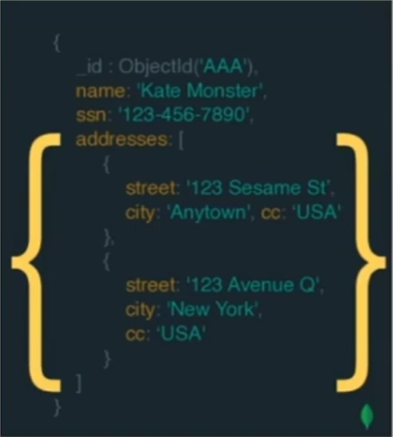
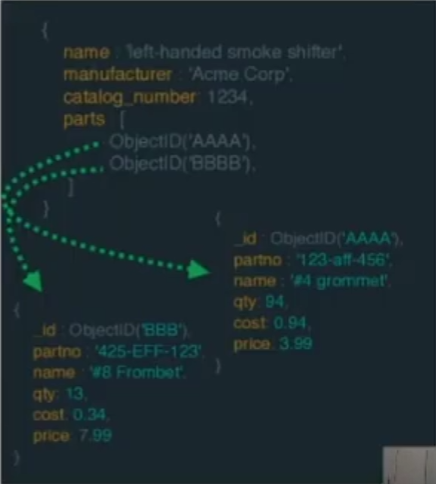
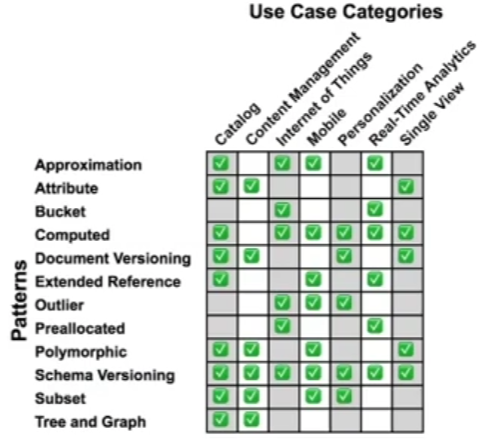

# Schema Design

1. Apresentar conceitos de Schema Design
2. Apresentar boas práticas
   
É recomendável que trabalhemos com relacionalmentos Embedding, mas também temos como trabalhar com Referência.

**Embedding**:
- Documentos auto contido, todas as informações do documento relacionado está contido nele.
  

Prós:
- Consulta informações em uma unica query.
- Atualiza o registro em uma única operação.

Contras:
- Limite de 16MB por documento.

**Referência**:
- Documentos com dependência de outros documentos ou collections.

Prós:
- Documentos pequenos
- Não duplica informações
- (Usado quando os dados não são acessados em todas as consultas)

Contras: 
- Duas ou mais queries ou utilização do $lookup

MongoDB não possui Foreign Key.

## Recomendações

Recomendações de acordo com os relacionamentos.

**One-to-one**: prefira atributos chave-valor no documento

    {
      "_id": ObjectID("609aeec3aa1a68ca982b47d7"),
      "name": "Lucas",
      "street": "Prof",
      "number": 80
    }

**One-to-few**: prefira embedding

    {
      "_id": ObjectID("609aeec3aa1a68ca982b47d7"),
      "name": "Lucas",
      "addresses":[
        {"street": "Rua Prof", "number": 80},
        {"street": "Av.", "number": 4311}
      ]
    }

**One-to-many** e **Many-to-many**: prefira referência

    {
      "_id": ObjectID("609aeec3aa1a68ca982b47d7"),
      "name": "Lucas",
      "addresses":[
        ObjectId('123'), ObjectId('1234')
      ]
    }

    {
      "_id": ObjectID("123"),
      "street": "Rua Prof",
      "number": 80
    }

    {
      "_id": ObjectID("1234"),
      "street": "Av.",
      "number": 4311
    }

https://www.mongodb.com/blog/post/building-with-patterns-a-summary/