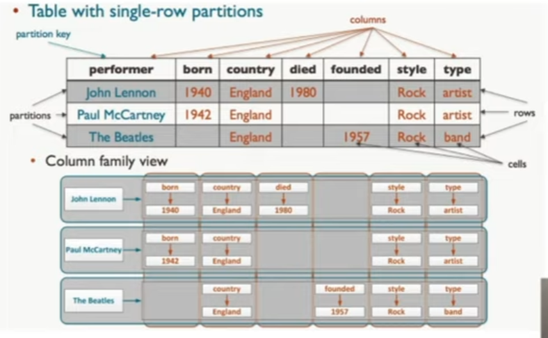
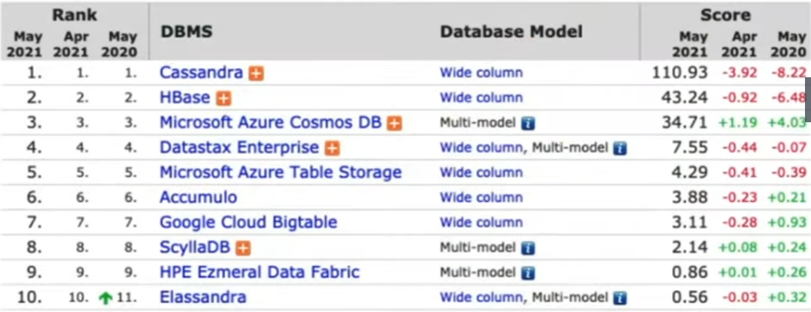

# Colunas

Eles armazenam as informações diretamente nas suas colunas, independente entre elas.

Elas já contém chave, valor e timestamp.

Diferente de tabelas em BD relacionados, as colunas em um BD não-relacionado só reservam e armazenam valores preenchidos.

**Keyspace**: agrupamento de famílias de colunas. (Database no SQL)

**Colum Family/table**: agrupamento de colunas. (Table no SQL)

**Row key**: chave que representa uma linha de coluna. É onde devemos focar nossas consultas para uma melhor performance. (Primary Key no SQL)

**Column:** representa um valor contendo: Name, Value, Timestamp.

Uso adequado de um BD não-relacional de colunas é quando se tem um volume muito maior de leitura do que de escrita, e o uso adequado é utilizando consultas pela sua chave-primária.

# Casandra

Primeiro banco de dados não-relacional baseado em colunas, criado pelo Facebook baseado no modelo de Big Table da Google. É utilizado pelo Facebook, Twitter, Netflix.

É utilizado em registro de transações: compras, resultados de testes, filmes assistidos e localização mais recente do filme.

Rastreando praticamente qualquer coisa, incluindo status do pedido, pacotes, etc.

https://cassandra.apache.org/_/index.html/

Sintaxe quase idêntica à SQL.

Criar KeySpace

    CREATE KEYSPACE IF NOT EXISTS keyspace_name WITH REPLICATION = {'class' : 'SimpleStrategy', 'replication_factor' : 1};

Entrar no Keyspace

    use keyspace_name;

Criar ColumnFamily

    CREATE COLUMNFAMILY IF NOT EXISTS column (name TEXT PRIMARY KEY, age int);

Consultar uma Column

    SELECT * FROM column;

Inserir valores

    INSERT INTO column (name, age) VALUES ('Lucas Santos', 25);

Inserir valores como se fossem JSON

    INSERT INTO column JSON '{"name": "Gabrielli Yoshio"}';

Consultar WRITETIME, e valor específico

    SELECT age, WRITETIME(age) FROM column WHERE name = 'Gabrielli Yoshio';

Consultar como se fossem JSON

    SELECT JSON * FROM column;

Alterar valores

    UPDATE column SET age=15 WHERE name='Gabrielli Yoshio';

Adicionar colunas no ColumnFamily

    ALTER COLUMNFAMILY column ADD hobby text;

Deletar valores

    DELETE FROM column WHERE name='Lucas Santos';

Consultar colunas de um KeySpace

    SELECT * FROM system_schema.columns WHERE keyspace_name='keyspace_name';