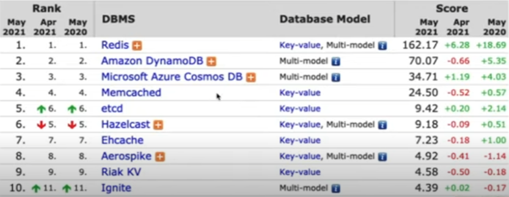

# Chave-valor

Armazena um conjunto de dados, seja ele simples ou complexo, indentificados por um indentificador exclusivo.

Não utiliza um schema.

Não existe possibilidade de fazer consultas por chave sem prévio conhecimento da chave.

\+ Bom desempenho em aplicações na nuvem.

\- Menor capacidade de busca.

Utilizados em cache, sessão de usuário, carrinhos de compra.

# Redis

Iremos utilizar o Redis, um banco de dados, cache, messageria e fila.

- Alto desempenho
- Estrutura de dados na memória.
- Versatilidade de uso.
- Replicação e persistência.

Utilizado pelo Twitter, GitHub, StackOverflow entre outros...

https://redis.io/

https://try.redis.io/

Criação de chave

    SET user1:name "Lucas Santos"

Consulta de chave

    GET user1:name

Inserção de JSON

    SET user '{"name":"Lucas", "age": 31}'

Criação de chaves que expiram em segundos

    SET user2:name "Gabrielli" EX 10

Criação de chaves que expiram em milisegundos

    SET user2:name "Gabrielli" PX 1000

Verificar se uma chave existe

    EXISTS user2:name

Inserir um dado numa lista

    LPUSH user1:hobbies "programação"
    LPUSH user1:hobbies "sonic"

Como acessar dados numa lista com base no index

    LINDEX user1:hobbies 0

Como acessar dados numa lista com base no

