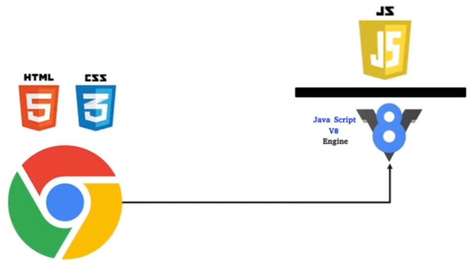
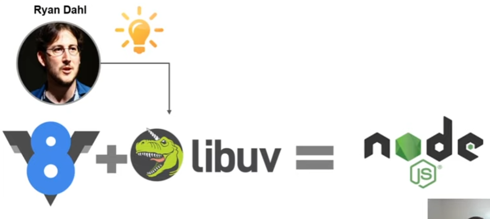

# Node.js

1. Conhecer o que é Node.js
2. Instalar o Node.js
3. Instalar seu editor de código.

## Requisitos

- Lógica de programação
- Pensamento computacional
- Conhecimentos prévios de JavaScript (desejável)

# Sobre o Node.js

- Não é uma linguagem de programação
- É uma plataforma que você pode programar
- Não é um framework JavaScript

Motor V8 do Chrome - é uma engine responsável por intepretar JavaScript

Ryan Dahl extraiu o V8 do Chrome, juntou com a Libuv e criou o Node.js e agora é possivel rodar em qualquer lugar.

- Interagir com banco de dados
- Criar servidores e Web Apps
- Se comunicar com outras Apps
- Trabalhar com websockets e apps em tempo real