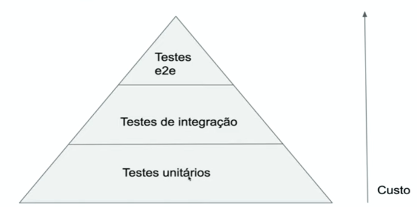

# Testes unitários

São os testes mais simples de serem escritos na aplicação. Como o nome sugere a ideia é testar apenas o componente (unidade) ao qual ele faz referência.

## Pirâmide de testes

## Mocks

Mocks são objetos, que substituem implementações reais em um cenário de testes unitários. Isso permite validar apenas os comportamentos afetados pelo novo componente.

